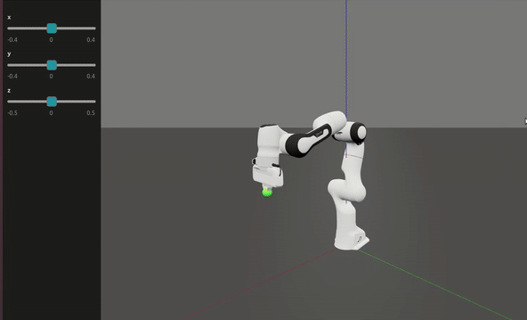
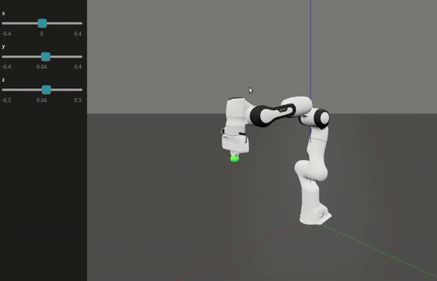
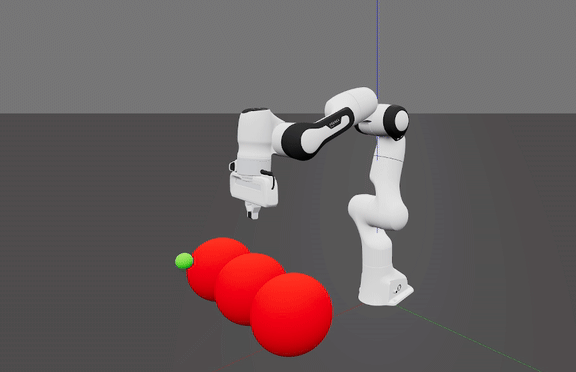
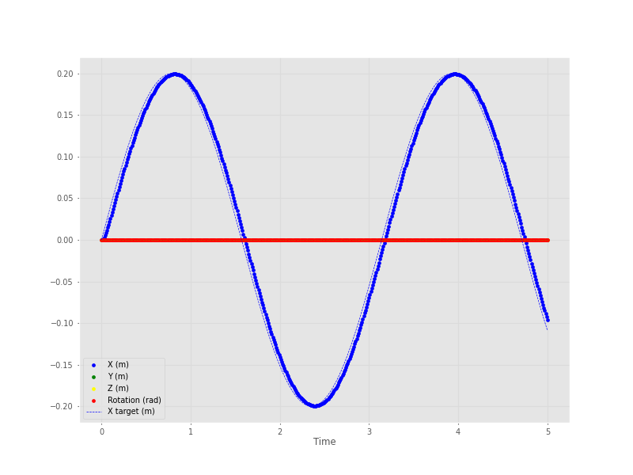
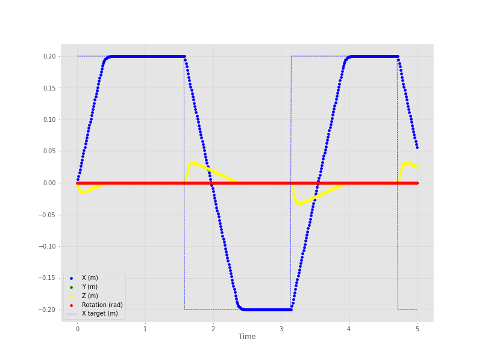

# 🤖 LMPC for Robotic Manipulators

[](https://www.python.org/)
[](https://pypi.org/)
[](LICENSE)

This project demonstrates **Quadratic Programming (QP)** and **Linear Model Predictive Control (LMPC)** for robotic manipulators.  
- **LMPC** is used for online path planning in dynamic workspaces.  
- **QP** solves Inverse Kinematics (IK) with constraints such as joint limits.  

The LMPC problem formulation is based on:  
> Alberto, Nicolas Torres, et al.  
> ["Linear Model Predictive Control in SE(3) for online trajectory planning in dynamic workspaces."](https://hal.science/hal-03790059/document) (2022)

---

## ⚡ Installation

Clone the repository and install the required dependencies:

```bash
pip install roboticstoolbox-python numpy qpsolvers
```

For the teleoperation demo (hand tracking via webcam):

```bash
pip install mediapipe opencv-python
```

For the plot:

```bash
pip install matplotlib
```

---

## 🚀 Run the Simulations

- **Proportional Control**  
  ```bash
  python simulation_robot.py
  ```
  A basic proportional controller.

- **QP Solver for IK**  
  ```bash
  python simulation_robot_QP.py
  ```
  QP controller in velocity for Inverse Kinematics with joint limits, null-space tasks, manipulability maximization, and weighted Jacobians.

- **LMPC + QP for Path Planning**  
  ```bash
  python simulation_robot_LMPC.py
  ```

  - **LMPC + Obstacles**  
  ```bash
  python simulation_LMPC_obstacles.py
  ```
  Adds spherical obstacles. To avoid obstacles, a convex polytope is defined as a corridor in which the effector must stay. In this example, the polytope is defined as a corridor around a cubic spline going from the start to the desired end point, such as the corridor avoids the obstacles. A better trajectory can be defined obviously (see my repo on RL and DMP). Only the end effector avoids the obstacles, to add more points (like the Panda's hand or intermediary joints), you need to put them in the QP.

- **Hand Teleoperation with LMPC**  
  ```bash
  python simulation_robot_hand_teleop.py
  ```
  Uses Mediapipe to map real-time hand motion (via webcam) to robot motion.

- **Hand Teleoperation with LMPC**  
  ```bash
  python simulation_LMPC_plot.py
  ```
  Simulates for a given time (5s in the example) with a sin desired target X position, and plots using matplotlib

---

## 📂 Project Structure

```
├── images/                         # Demo GIFs
│   ├── QP.gif
│   ├── LMPC.gif
│   └── Teleop.gif
├── simulation_robot.py             # Basic proportional controller
├── simulation_robot_QP.py          # QP IK solver with constraints
├── simulation_robot_LMPC.py        # LMPC + QP for path planning
├── simulation_robot_hand_teleop.py # Hand teleoperation with LMPC
├── simulation_LMPC_obstacles.py    # LMPC with spherical obstacles
├── README.md                       # Project documentation
└── LICENSE                         # License file
```

---

## 🎥 Demos

<div align="center">

### 🔹 QP Solver


---

### 🔹 LMPC


---

### 🔹 LMPC with obstacles


---


### 🔹 Hand Teleoperation with LMPC


---

### 🔹Plot with X sin desired target trajectory


---

### 🔹Plot with X square desired target trajectory


</div>

---

## 📜 License
This project is licensed under the [MIT License](LICENSE).  

---

## ⭐ Acknowledgments
- Inspired by the work of Alberto, Nicolas Torres, et al. (2022).  
- Built with [Robotics Toolbox for Python](https://github.com/petercorke/robotics-toolbox-python).  
